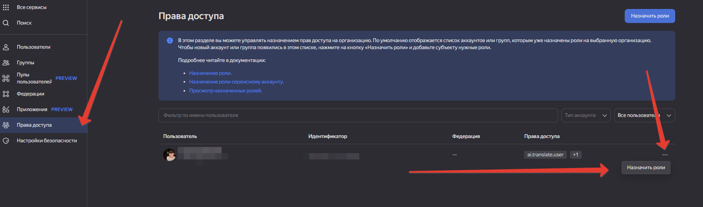

# Приложение для перевода фраз через Яндекс.API
Использует PHP и PostgreSQL

Всё, что находится в таблице **translations** в столбце **source_language**, будет переведено и результат перевода будет добавлен в столбец **target_language**.  
Можно выбрать язык с какого на какой произвести перевод:
* en - английский
* ru - русский

Запустить работу можно так:
```shell
make init
make app
```

## Структура базы данных
Перед использованием создать таблицу 

```sql
CREATE TABLE translations (
                              id SERIAL PRIMARY KEY,
                              source_text TEXT NOT NULL,
                              source_language VARCHAR(10) NOT NULL,
                              target_language VARCHAR(10) NOT NULL,
                              translated_text TEXT,
                              created_at TIMESTAMP DEFAULT CURRENT_TIMESTAMP,
                              updated_at TIMESTAMP DEFAULT CURRENT_TIMESTAMP
);
```
Как получить токен авторизации (**YANDEX_OAUTH_TOKEN**): Заходим под своим аккаунтом в яндекс и проходим по ссылке - https://oauth.yandex.ru/verification_code 

Как получить IAM токен (**YANDEX_IAM_TOKEN**): 
Подставить YANDEX_OAUTH_TOKEN в bin/iam.php и выполнить
```shell
make iam
```

Без **YANDEX_FOLDER_ID** тоже ничего работать не будет, как его получить:
https://yandex.cloud/ru/docs/resource-manager/operations/folder/get-id#cli_1  
Переходим в Яндекс консоль и копируем его оттуда


Для работы сервиса так же необходимо назначить пользователю роль **ai.translate.user**
Иначе будет ошибка **Permission denied**  

